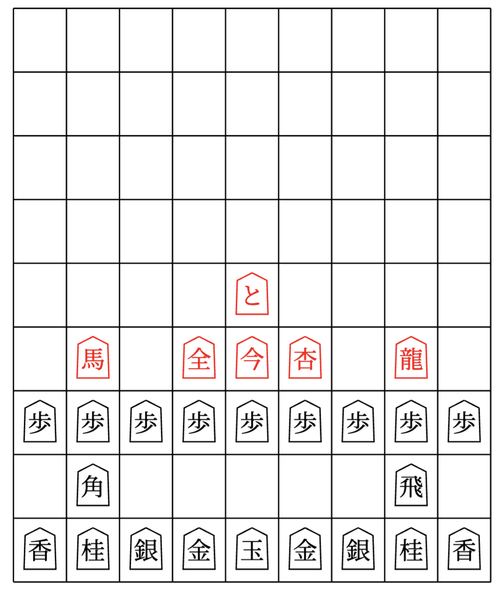

# LaTeX Shogi Diagrams

A package for drawing shogi vector diagrams with LaTeX.

  

## References

- Repos:
  - [@psygo/latex-go-diagrams-template](https://github.com/psygo/latex-go-diagrams-template)
  - [@FanaroEngineering/traducao_como_jogar_go](https://github.com/FanaroEngineering/traducao_como_jogar_go)
  - [@psygo/tecnicas_de_go](https://github.com/psygo/tecnicas_de_go)
- TeX Stack Exchange:
  - [Japanese Artsy Cursive Fonts for Shogi](https://tex.stackexchange.com/q/730168/64441)
