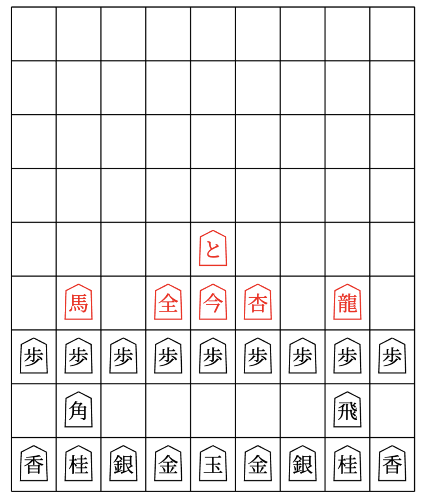
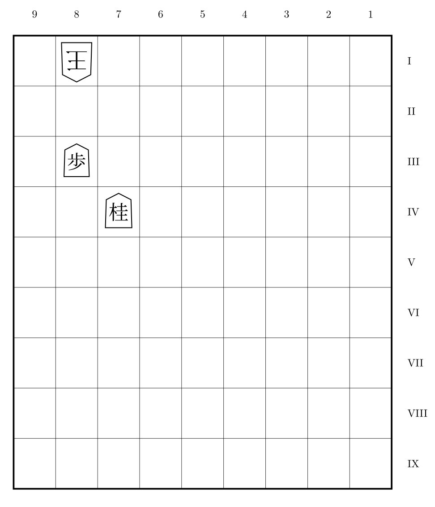
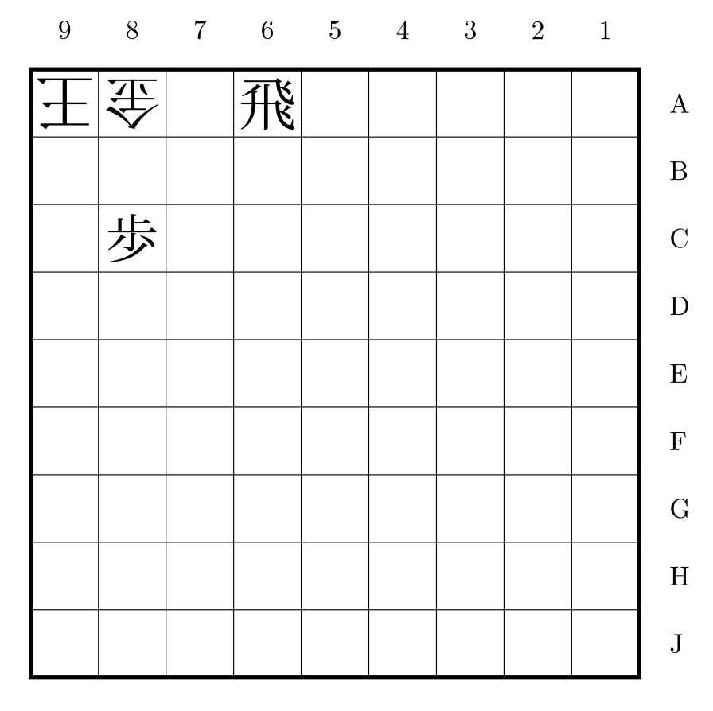

# LaTeX Shogi Diagrams

A package for drawing shogi vector diagrams with LaTeX.

> Take a look at sample pdfs [1](./assets/sample_1.pdf) and [2](./assets/sample_2.pdf).







## Generating SVG Images from the PDF

You can open the PDF through a graphical editor, such as [Inkscape](https://inkscape.org/), and then export a selection as an SVG.

You can use the `standalone` document type &mdash; see the [`shogi_diagram_export.tex`](./src/shogi_diagram_export.tex) file &mdash; to export the diagram from a PDF to an SVG:

```sh
pdftocairo -svg filename.pdf filename.svg
```

## References

- Repos:
  - [@psygo/latex-go-diagrams-template](https://github.com/psygo/latex-go-diagrams-template)
  - [@FanaroEngineering/traducao_como_jogar_go](https://github.com/FanaroEngineering/traducao_como_jogar_go)
  - [@psygo/tecnicas_de_go](https://github.com/psygo/tecnicas_de_go)
  - [@psygo/tsumego_workbooks](https://github.com/psygo/tsumego_workbooks)
- TeX Stack Exchange:
  - [Japanese Artsy Cursive Fonts for Shogi](https://tex.stackexchange.com/q/730168/64441)
- Useful Software:
  - [Inkscape](https://inkscape.org/)
